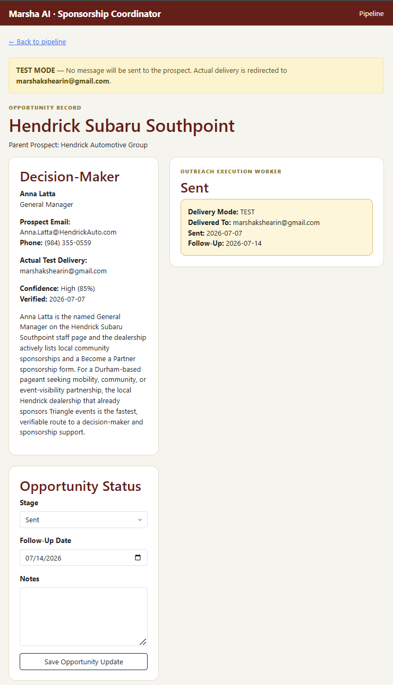

# Marsha AI — Sponsorship Coordinator

An AI-powered workflow system that researches sponsorship prospects, identifies decision-makers, prepares personalized outreach, applies an independent message quality review, and manages approved opportunities through a persistent sponsorship pipeline.

This project demonstrates how AI can be integrated into a real business process without removing human judgment from consequential decisions.

## Working Application

The screenshot below shows a live opportunity record after the Message Quality Review Worker has reviewed and improved the sponsorship outreach. The Director can inspect the researched decision-maker, review AI quality-control notes and risk flags, edit the final message, and approve controlled test delivery.

## The Business Problem

Sponsorship development often requires a director or small team to manually:

- research potential sponsors,
- determine whether an organization is a good fit,
- locate the appropriate decision-maker,
- verify contact information,
- write personalized outreach,
- track the status of each opportunity,
- remember follow-up dates, and
- maintain continuity across the sponsorship process.

The Sponsorship Coordinator converts that fragmented work into a structured workflow.

The goal is not simply to generate text. The system coordinates research, decision-making, quality control, outreach execution, and pipeline management while preserving human approval at critical points.

## Current Workflow

1. The Director selects a sponsorship category.
2. The Prospect Research Worker researches a potential sponsor.
3. The system identifies and evaluates a decision-maker.
4. The Director reviews the research evidence.
5. An approved opportunity is saved to the sponsorship pipeline.
6. The Outreach Execution Worker prepares a personalized message.
7. The Message Quality Review Worker independently reviews and improves the draft.
8. The Director reviews the final message before delivery.
9. In test mode, delivery is redirected to a controlled test inbox.
10. The system records the send date and automatically schedules follow-up.

## AI Worker Architecture

### Prospect Research Worker

Researches a potential sponsor and returns structured information including:

- parent organization,
- recommended local target,
- sponsorship category,
- opportunity score,
- decision-maker,
- title and department,
- contact information,
- confidence level,
- verification date,
- supporting sources, and
- an explanation of why the contact is relevant.

The Director must approve the opportunity before it enters the pipeline.

### Outreach Execution Worker

Uses the approved opportunity record to prepare personalized outreach based on:

- the sponsorship initiative,
- the prospect,
- the selected decision-maker,
- the organization’s mission,
- the potential partnership fit, and
- the desired next action.

### Message Quality Review Worker

Performs a separate quality-control pass before outreach is sent.

The worker:

- reviews the subject line,
- improves clarity and tone,
- checks personalization,
- identifies potential risks,
- recommends verification steps,
- produces an improved message, and
- preserves review notes for the Director.

The reviewed message remains subject to human approval.

## Human-in-the-Loop Controls

The system is intentionally designed so AI does not make every decision autonomously.

Human review is required before:

- a researched prospect is added to the pipeline,
- AI-generated outreach is accepted,
- a quality-reviewed message is sent, and
- an opportunity advances based on real-world activity.

This design keeps the Director in control while allowing AI workers to handle research, drafting, review, and workflow coordination.

## Controlled Test Delivery

The application includes a `TEST_MODE` safeguard.

When enabled:

- prospect email addresses remain visible for workflow testing,
- outbound messages are redirected to a configured test inbox,
- the subject line clearly identifies the message as a test,
- no message is delivered to the real prospect, and
- the application still exercises the complete send and follow-up workflow.

This allows end-to-end testing without accidentally contacting a real sponsor.

## Persistent Opportunity Pipeline

Approved opportunities are stored in a database rather than treated as isolated AI conversations.

Each opportunity can preserve:

- prospect information,
- decision-maker research,
- opportunity score,
- current stage,
- outreach content,
- quality-reviewed content,
- review notes,
- delivery status,
- sent date,
- follow-up date, and
- Director notes.

This allows the system to maintain operational history and next actions across the sponsorship lifecycle.

## Technology Stack

- Python
- Flask
- SQLAlchemy
- SQLite
- OpenAI API
- HTML
- CSS
- Jinja templates
- SMTP email delivery
- Git and GitHub

## System Design Principles

This project is built around several principles:

**Workflow before chatbot.**  
The system is designed around a business outcome and a sequence of specialized tasks rather than an open-ended conversation.

**AI workers with defined responsibilities.**  
Research, outreach preparation, and message quality review are separate functions.

**Human approval at consequential steps.**  
AI assists the Director but does not independently approve prospects or initiate live outreach.

**Persistent operational state.**  
Opportunities remain in a pipeline with history, status, and next actions.

**Safe testing before live execution.**  
Test mode allows the full workflow to be validated without contacting real prospects.

## Current Status

The current MVP supports:

- AI-assisted prospect research,
- decision-maker identification,
- source-backed research evidence,
- Director approval,
- persistent opportunity records,
- sponsorship pipeline management,
- AI-generated personalized outreach,
- independent AI message quality review,
- editable final messages,
- controlled test email delivery,
- automatic sent-date recording, and
- automatic follow-up scheduling.

## Planned Development

Future iterations may include:

- additional sponsorship categories,
- configurable organization and initiative profiles,
- multiple contacts per sponsor,
- richer opportunity stage history,
- automated follow-up preparation,
- response tracking,
- production database deployment,
- user authentication and role-based access, and
- reporting on outreach and sponsorship conversion.

## Security

Secrets and credentials are stored in environment variables and are not committed to the repository.

The repository includes `.env.example` to document required configuration without exposing:

- OpenAI API keys,
- email credentials,
- application secrets, or
- local test data.

## Project Context

The Sponsorship Coordinator is the first vertical workflow within the broader Marsha AI concept: a system in which specialized AI workers cooperate with people, business processes, and persistent software systems to produce completed business outcomes.

Rather than asking a chatbot to perform isolated tasks, the system coordinates a defined sequence of work from research through execution and follow-up.
